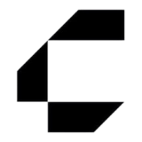
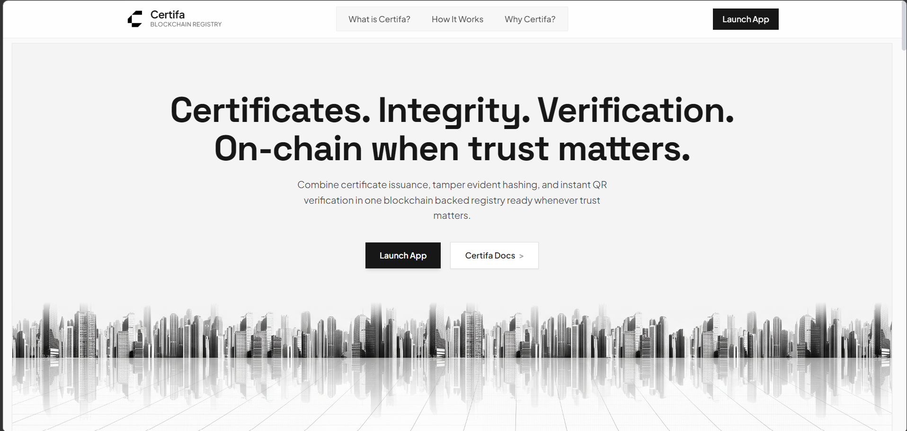
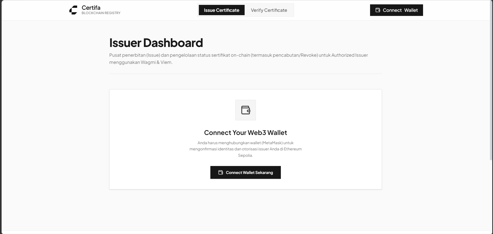
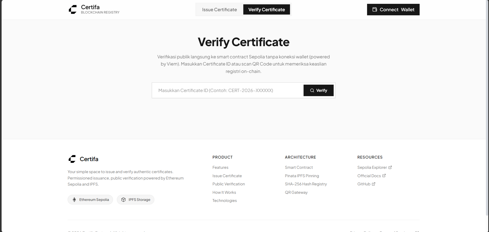

<p align="center">
  
</p>

<h1 align="center">Certifa Protocol</h1>

<p align="center">
  <strong>Decentralized Certificate Registry with Permissioned Issuance & Public Verification</strong><br />
  <em>Anchored on Ethereum Sepolia & IPFS Storage</em>
</p>

<p align="center">
  
  
  
  
  
</p>

---

## 📌 Overview

**Certifa** is a decentralized application (DApp) that transforms traditional digital certificates into tamper-proof, cryptographic, and verifiable credentials. By combining **permissioned smart contract issuance** with **instant zero-gas public verification**, Certifa solves the vulnerabilities of certificate fraud, unauthorized alterations, and fake credentials.

### 🔑 Core Principle:
> *"Permissioned Issuance, Public Verification"*
> - **Issuance**: Restricted only to authorized issuer wallet addresses vetted by the smart contract owner.
> - **Verification**: Open 100% publicly to anyone without requiring a Web3 wallet, MetaMask, account registration, or gas fees.

---

## ✨ Key Features

- 🛡️ **Role-Based Access Control (RBAC)**: Smart contract guarantees only registered institution wallets can mint and issue certificate records.
- ⚡ **Zero-Gas Instant Verification**: Public verification executes direct `view` calls via Viem RPC on Ethereum Sepolia in milliseconds.
- 🔏 **Tamper-Evident SHA-256 Hashing**: Automatic cryptographic fingerprinting ensures any modification to document contents results in an immediate hash mismatch.
- 📷 **Dynamic QR Code Stamping**: Real-time QR code injection onto certificates (PDF and image formats: PNG/JPG/WEBP) pointing directly to the verification gateway.
- 📦 **Decentralized IPFS Storage**: Certificates and metadata are stored on IPFS via Pinata pinning service with immutable Content Identifiers (CID).
- 🚫 **On-Chain Revocation Registry**: Issuers can transparently revoke invalidated credentials with permanent on-chain status tracking.
- 📱 **Fully Responsive Modern Interface**: Sleek monochrome design built with React 19, Tailwind CSS, and Framer Motion, optimized for mobile, tablet, and desktop screens.

---

## 🏛️ System Architecture

```text
                                 CERTIFA ARCHITECTURE
                                          │
             ┌────────────────────────────┴────────────────────────────┐
             │                                                         │
       FRONTEND DAPP                                             BACKEND API
   (React 19 + Wagmi + Viem)                                 (Express + Node.js)
             │                                                         │
             │ 1. Upload original certificate file + recipient         │
             ├────────────────────────────────────────────────────────►│ 2. Generate QR Code
             │                                                         │ 3. Stamp QR onto File
             │                                                         │ 4. Compute Final SHA-256
             │ 5. Return: { certId, certHash, ipfsCID }                │ 5. Pin file to Pinata IPFS
             │◄────────────────────────────────────────────────────────┘
             │
             │ 6. Submit issueCertificate() tx (MetaMask Signer)
             ▼
      SMART CONTRACT (Ethereum Sepolia)
      Contract: 0xAFC8bB36572ac3CcEa6c908dC8D26cd54E9c258a
             │
             ├──────────────────────────┬──────────────────────────┐
             ▼                          ▼                          ▼
      onlyAuthorizedIssuer      issueCertificate()          getCertificate()
     (Validates Issuer Role)  (Stores Hash & IPFS CID)   (Public Instant Read)
```

---

## 📸 Screenshots & UI Preview

### 🖥️ 1. Landing Page

*Modern responsive landing page featuring 3D interactive stack layers, step-by-step workflow guide, and decentralized technology pillars.*

<br/>

### 📜 2. Issuer Dashboard (Issue Certificate)

*Permissioned Web3 issuance portal for authorized institutions with dynamic QR stamping, IPFS pinning, and on-chain certificate management.*

<br/>

### 🔍 3. Public Verification Portal

*Public, zero-gas verification directly querying the Ethereum Sepolia smart contract registry, complete with local file SHA-256 hash match integrity check.*

---

## 📂 Repository Structure

Certifa is structured as a modular monorepo:

```text
Certifa/
├── blockchain/               # Hardhat smart contract development environment
│   ├── contracts/            # Solidity contracts (CertificateRegistry.sol)
│   ├── scripts/              # Deployment and verification scripts
│   └── hardhat.config.js     # Sepolia network & compiler configuration
│
├── backend/                  # Node.js Express REST API
│   └── src/
│       ├── controllers/      # Certificate processing & file hash controllers
│       ├── services/         # QR code stamping (Sharp/pdf-lib) & Pinata IPFS
│       └── routes/           # REST endpoints (/api/certificates)
│
├── frontend/                 # Client React 19 Single Page Application
│   ├── src/
│   │   ├── components/       # Navbar, Footer, UI components
│   │   ├── context/          # WalletContext (Wagmi Web3 wallet connection)
│   │   ├── config/           # Viem public client & contract ABI configurations
│   │   └── pages/            # Home (Landing), Issue (Issuer Portal), Verify
│   └── vite.config.js        # Vite build & bundler configuration
│
└── docs/                     # VitePress documentation portal
```

---

## ⛓️ Smart Contract Deployment

| Parameter | Details |
| :--- | :--- |
| **Network** | Ethereum Sepolia Testnet |
| **Chain ID** | `11155111` |
| **Contract Name** | `CertificateRegistry` |
| **Contract Address** | [`0xAFC8bB36572ac3CcEa6c908dC8D26cd54E9c258a`](https://sepolia.etherscan.io/address/0xAFC8bB36572ac3CcEa6c908dC8D26cd54E9c258a) |
| **Compiler Version** | Solidity `^0.8.24` |
| **License** | MIT |

---

## 🚀 Getting Started

### 1. Prerequisites
- **Node.js**: `v18+` or `v20+` recommended
- **npm** or **pnpm**
- **MetaMask** browser extension configured with Sepolia Testnet ETH

---

### 2. Clone the Repository
```bash
git clone https://github.com/whyu27/Certifa.git
cd Certifa
```

---

### 3. Backend Setup
```bash
cd backend
npm install
```

Buat file `.env` di dalam folder `backend/`:
```env
PORT=5000
FRONTEND_URL=http://localhost:5173
PINATA_JWT=your_pinata_jwt_secret_token
PINATA_GATEWAY=gateway.pinata.cloud
```

Jalankan server backend:
```bash
npm run dev
# Server running at http://localhost:5000
```

---

### 4. Frontend Setup
```bash
cd ../frontend
npm install
```

Jalankan aplikasi frontend:
```bash
npm run dev
# Frontend running at http://localhost:5173
```

---

### 5. (Optional) Documentation Portal
```bash
cd ../docs
npm install
npm run dev
# Docs portal running at http://localhost:5174
```

---

## 🧪 Smart Contract Development & Testing

Untuk melakukan kompilasi atau deploy ulang smart contract ke Sepolia:

```bash
cd blockchain
npm install

# Compile contracts
npx hardhat compile

# Deploy to Ethereum Sepolia
npx hardhat run scripts/deploy.js --network sepolia
```

---

## 🛡️ Security & Integrity Workflow

1. **Original Certificate**: Pengunggah memilih dokumen asli (PDF atau gambar).
2. **Deterministic ID**: Diberikan Certificate ID unik berbasis timestamp dan serial.
3. **QR Stamping**: QR Code disematkan langsung ke dalam file visual.
4. **Final Hash Generation**: File ber-QR dihitung nilai SHA-256 hash-nya (`bytes32`).
5. **IPFS Pinning**: File final diunggah ke jaringan IPFS terdesentralisasi.
6. **On-Chain Recording**: Metadata dan hash disimpan secara permanen di blockchain Sepolia.
7. **Verification**: Pihak ketiga dapat memverifikasi ID atau mengunggah file untuk membandingkan hash lokal dengan hash on-chain.

---

## 📄 License

Project ini dilisensikan di bawah lisensi **MIT License** — lihat berkas [LICENSE](LICENSE) untuk detail lebih lanjut.

---

<p align="center">
  Built with ❤️ for decentralized trust and verifiable credentials.
</p>
